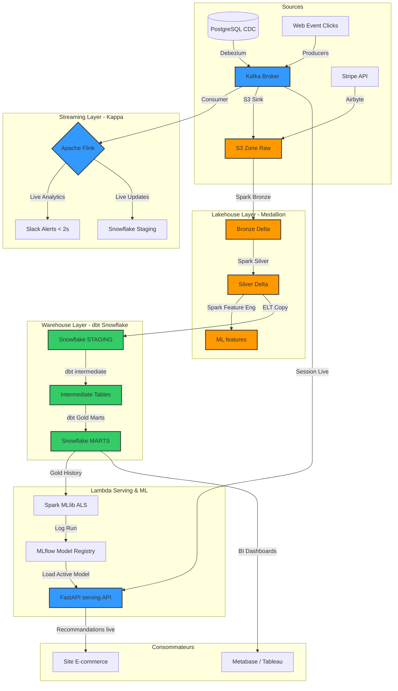

# Documentation Technique & Architecture de la Plateforme Data E-Commerce

Ce document détaille de manière approfondie l'architecture, les flux de données, les modèles mathématiques sous-jacents, ainsi que les stratégies de gestion des erreurs techniques et métiers de notre plateforme.

---

## 🏛️ 1. Paradigmes d'Architecture Adoptés (Pourquoi & Comment)

Notre plateforme combine intelligemment plusieurs architectures modernes majeures afin de résoudre différents défis techniques et métiers de manière optimale.

### A. Les 5 Paradigmes Utilisés dans le Projet

#### 1. Architecture Kappa (Streaming Layer)
- **Pourquoi ce choix ?** Pour le stock en temps réel et la détection immédiate de fraude. Attendre un traitement batch quotidien pour ces opérations critique de vente en ligne introduirait une latence inacceptable (survente ou fraudes bancaires répétées).
- **Comment ça fonctionne ?** Kafka sert de buffer d'ingestion central à haut débit. Apache Flink consomme directement ces flux en continu, exécute les calculs analytiques à la volée (fenêtres temporelles glissantes) et envoie des alertes ou deductions instantanées via ses Sinks (Slack, console) en moins de 2 secondes.

#### 2. Architecture Lambda (Serving & ML Layer)
- **Pourquoi ce choix ?** Pour le moteur de recommandation de produits. Les prédictions basées purement sur le temps réel manquent de recul historique (profil utilisateur global), tandis que les prédictions purement batch ne s'adaptent pas à la navigation active du client en cours.
- **Comment ça fonctionne ?** 
  - **Batch Layer (Chemin lent/précis)** : PySpark entraîne de manière hebdomadaire un modèle de filtrage collaboratif ALS sur les données historiques exhaustives consolidées dans Snowflake, puis enregistre le modèle dans le registre MLflow.
  - **Speed Layer (Chemin rapide/approximatif)** : Les clics de navigation de la session en cours sont ingérés par Kafka.
  - **Serving Layer (FastAPI)** : L'API FastAPI charge le modèle MLflow actif et fusionne à la volée les caractéristiques batch (profil historique) et les interactions en direct (session en cours) pour servir des recommandations hautement personnalisées.

#### 3. Data Lakehouse (Medallion Architecture)
- **Pourquoi ce choix ?** Stocker des pétaoctets de logs bruts directement dans un data warehouse coûte extrêmement cher. Le Lakehouse combine le prix très bas et la flexibilité d'un Data Lake (AWS S3) avec les transactions ACID et la fiabilité d'un Data Warehouse (Delta Lake).
- **Comment ça fonctionne ?** Les données brutes atterrissent d'abord dans la zone **Raw** de S3. PySpark structure ces données en Delta Lake de manière incrémentale à travers les couches **Bronze** (données brutes partitionnées) et **Silver** (nettoyées, typées et dédupliquées).

#### 4. Modern ELT (dbt + Snowflake + Airflow)
- **Pourquoi ce choix ?** Pour l'analyse décisionnelle (BI). SQL est le langage standard, et Snowflake offre une puissance de calcul SQL élastique incomparable pour requêter des milliards de lignes en secondes. dbt permet d'appliquer les pratiques logicielles (tests, modularité) aux transformations de données.
- **Comment ça fonctionne ?** Les données fiables de la zone **Silver** de S3 sont chargées dans Snowflake. dbt prend ensuite le relais dans le warehouse pour compiler et exécuter les transformations SQL déclaratives (Bronze $\rightarrow$ Silver $\rightarrow$ Gold / Marts), le tout orchestré quotidiennement par les DAGs Airflow.

#### 5. Data Mesh (Organisation décentralisée)
- **Pourquoi ce choix ?** Éviter que l'équipe data centrale ne devienne un goulot d'étranglement organisationnel au fur et à mesure que l'entreprise grandit.
- **Comment ça fonctionne ?** Les responsabilités sont réparties par domaines métiers. L'équipe Commandes publie son Data Product (`mart_orders`), l'équipe Finance gère ses rapports de revenus (`mart_revenue`), et le Marketing gère les campagnes (`mart_campaigns`). Chaque produit dispose d'un contrat de données strict (`orders_contract.yml`), validé automatiquement à chaque run par Great Expectations, et exposé dans le catalogue centralisé DataHub.

---

### 🛢️ B. Rôle Distribué : Data Lake (S3) vs Data Warehouse (Snowflake)

| Critère | Data Lake (AWS S3) | Data Warehouse (Snowflake) |
| :--- | :--- | :--- |
| **Objectif Principal** | Stockage universel brut et immuable + features ML. | Moteur analytique SQL haute performance et gouvernance d'entreprise. |
| **Structure des Données**| Schema-on-Read (JSON brut, Parquet, Delta Lake, logs, images). | Schema-on-Write (Tables relationnelles hautement indexées et optimisées). |
| **Coût** | Très économique (stockage objet standard). | Modéré à élevé (facturation élastique au calcul + stockage cloud). |
| **Utilisateurs Cibles** | Data Engineers (ingestion), Data Scientists (modèles ML). | Data Analysts, Business Intelligence (BI), équipes Finance & Marketing. |
| **Paradigme de Calcul** | Traitements batch distribués de masse (PySpark). | Transformations SQL dbt (ELT) & requêtes décisionnelles rapides. |

---

## 🗺️ 2. Architecture Globale & Data Mesh

La plateforme intègre deux grands paradigmes d'architecture :
1. **L'architecture Lambda & Kappa** : Coexistence du streaming en temps réel (Kappa) pour la réactivité critique et du traitement batch (Medallion) pour les analyses historiques exhaustives et l'entraînement ML.
2. **Le Data Mesh** : Organisation décentralisée par domaines fonctionnels autonomes (Orders, Finance, Marketing). Chaque domaine publie ses données sous forme de "Data Product" régi par un contrat de données strict.

---

## 🔄 3. Les Flux de Données (Data Flows)

### A. Le flux Streaming Temps Réel (Kappa)
- **Ingestion** : Les clics et ajouts au panier du site e-commerce sont poussés en continu dans le topic Kafka `web_events` sous format binaire Avro pour des raisons d'efficacité de stockage et de contrôle de schéma.
- **Traitement Flink** : 
  - **Stock live** : Soustraction immédiate des stocks à chaque "ajout au panier" pour éviter la survente.
  - **Détection de fraude** : Détection à la volée des transactions suspectes (ex: montants anormalement élevés en rafale).
- **Sinks** : Publication instantanée des alertes sur Slack et mise à jour de dashboards Grafana en moins de 2 secondes.

### B. Le flux Batch Lakehouse (Medallion)
- **Raw Zone (S3)** : Stockage immuable et brut de tous les événements capturés.
- **Bronze Zone (Delta Lake)** : Lecture des fichiers bruts par PySpark et écriture incrémentale sous format Delta.
- **Silver Zone (Delta Lake)** : Nettoyage, normalisation des formats de temps, typage strict et déduplication des identifiants (ex: commandes CDC dupliquées).
- **Gold Zone (Snowflake via dbt)** : Chargement et structuration finale :
  - `mart_orders` : Synthèse order + payment.
  - `mart_revenue` : KPIs financiers calculés par jour.
  - `mart_campaigns` : Segments d'audience marketing pour le ciblage.

---

## 🧮 4. Formules Mathématiques & Algorithmes

### A. Système de Recommandation : Alternating Least Squares (ALS)
Le module ML (`ml/training/train_recommender.py`) implémente la factorisation de matrice collaborative ALS (Alternating Least Squares) pour prédire l'affinité d'un utilisateur $u$ pour un produit $i$.

#### 1. La Fonction Objectif (Loss Function)
ALS cherche à décomposer la matrice d'interaction Utilisateur-Produit en deux sous-matrices de rang inférieur : $X$ (profils utilisateurs) et $Y$ (profils produits), de dimensions respectives $k \times U$ et $k \times I$, en minimisant la fonction de coût régularisée suivante :

$$\min_{X, Y} \sum_{u, i} c_{ui} \left( p_{ui} - x_u^T y_i \right)^2 + \lambda \left( \sum_u \|x_u\|^2 + \sum_i \|y_i\|^2 \right)$$

Où :
- $p_{ui}$ est la **préférence** de l'utilisateur $u$ pour l'article $i$ ($p_{ui} = 1$ si $u$ a acheté $i$, $p_{ui} = 0$ sinon).
- $c_{ui}$ est la **confiance** associée à l'interaction, modélisée à partir de la fréquence d'interaction $r_{ui}$ (nombre de clics, ajouts panier, achats) :
  
  $$c_{ui} = 1 + \alpha r_{ui}$$
  
  (dans notre code, $\alpha$ est configuré par défaut à `40.0` pour maximiser le signal implicite).
- $x_u \in \mathbb{R}^k$ représente le vecteur de facteurs latents pour l'utilisateur $u$.
- $y_i \in \mathbb{R}^k$ représente le vecteur de facteurs latents pour le produit $i$.
- $\lambda$ est le paramètre de **régularisation** pour éviter le surapprentissage (overfitting).

#### 2. Résolution Alternée (Alternating Step)
La fonction objectif n'est pas convexe globalement, mais elle le devient si l'on fixe l'une des deux variables ($X$ ou $Y$). L'algorithme ALS alterne donc :

1. **Fixer $Y$ et résoudre pour $X$** :
   Pour chaque utilisateur $u$, on calcule la dérivée par rapport à $x_u$, ce qui donne la solution analytique directe :
   
   $$x_u = \left( Y^T C^u Y + \lambda I \right)^{-1} Y^T C^u p_u$$
   
   *(Où $C^u$ est la matrice diagonale des confiances pour l'utilisateur $u$ et $p_u$ le vecteur de ses préférences).*

2. **Fixer $X$ et résoudre pour $Y$** :
   De la même façon, pour chaque produit $i$, on calcule :
   
   $$y_i = \left( X^T C^i X + \lambda I \right)^{-1} X^T C^i p_i$$

### B. Indicateur Statistique de Fraude en Temps Réel : Le Z-Score Glissant
Pour identifier des anomalies de transaction (ex: panier anormalement élevé par rapport à l'historique de la session active de l'utilisateur), Flink peut calculer le **Z-Score glissant** sur une fenêtre temporelle $W$ :

$$Z = \frac{x_t - \mu_W}{\sigma_W}$$

Où :
- $x_t$ est le montant de la transaction courante.
- $\mu_W$ est la moyenne glissante des transactions calculée sur la session : $\mu_W = \frac{1}{N}\sum_{j=1}^N x_j$.
- $\sigma_W$ est l'écart-type glissant : $\sigma_W = \sqrt{\frac{1}{N}\sum_{j=1}^N (x_j - \mu_W)^2}$.

Une alerte critique est déclenchée immédiatement si $|Z| > 3.0$ (déviation de 3 écarts-types, représentant moins de 0.3% des cas nominaux sous l'hypothèse d'une distribution normale).

---

## 🚨 5. Gestion des Erreurs (Error Handling)

Une plateforme de production doit être hautement résiliente. Nous séparons les stratégies de résolution selon le type d'erreur.

### A. Gestion des Erreurs Techniques

| Événement Critique | Conséquence Directe | Stratégie de Résilience & Résolution |
| :--- | :--- | :--- |
| **Panne d'un Broker Kafka** | Perte de connectivité d'ingestion. | Réplication configurée avec `replication_factor: 3` et `min.insync.replicas: 2`. Si un broker tombe, les deux autres prennent le relais sans perte ni interruption. |
| **Désynchronisation Avro** | Structure d'événement non conforme reçue. | Utilisation du **Confluent Schema Registry**. Toute tentative de pousser un schéma incompatible (ex: champ obligatoire manquant) est rejetée au niveau du Producer avec levée d'une alerte typée. |
| **Rupture Réseau Snowflake** | Échec des chargements d'écriture dbt. | Stratégie d'**Exponential Backoff** dans les DAGs Airflow. En cas d'échec de connexion, le task retente son exécution jusqu'à 3 fois en espaçant les tentatives de 1, 5 puis 15 minutes. |
| **Crash d'un Flink Worker** | Arrêt du calcul en temps réel. | Flink utilise des **Checkpoints** persistés sur S3. En cas de crash, le jobmanager redémarre instantanément un nouveau worker et reprend l'état exact au dernier checkpoint (garantie de traitement *Exactly-Once*). |

---

### B. Gestion des Erreurs Métiers & Anomalies Fonctionnelles

#### 1. La Stratégie du Dead Letter Queue (DLQ)
Si Flink ou Spark rencontrent un événement corrompu ou illisible (ex: un champ JSON mal formé qui passe au travers des filtres élémentaires), le pipeline ne doit pas s'arrêter.
- L'événement problématique est tagué avec des métadonnées enrichies (horodatage, message d'erreur, cause du rejet).
- Il est routé automatiquement vers un topic Kafka dédié appelé `dead_letter_queue` (DLQ) pour analyse ultérieure (Post-Mortem).
- Le flux principal continue sans interruption.

#### 2. Déduplication Idempotente (Double Achat)
Dans les environnements distribués, les pannes réseau peuvent provoquer le renvoi d'événements déjà traités (garantie *At-Least-Once* d'ingestion).
- **Solution Spark** : Dans la couche Silver (`silver_cleaning.py`), l'utilisation de `dropDuplicates(["order_id"])` couplée aux opérations Delta Lake `merge_delta_tables` garantit l'idempotence stricte. Une commande insérée ou modifiée plusieurs fois n'apparaîtra qu'une seule et unique fois dans la base finale.

#### 3. Déviation de Données (Data Drift)
Si les comportements d'achat des clients changent brutalement (ex: période de soldes ou Black Friday), les performances du modèle ML ALS peuvent décliner.
- **Solution** : **Great Expectations** valide quotidiennement la distribution du panier moyen (`total_amount`). Si la déviation statistique sort de la plage définie (contrats de données définissant un max de 100k€ par commande), une alerte de qualité de données est déclenchée, ce qui notifie immédiatement les Data Scientists pour relancer un entraînement ML supervisé.

---

## 📂 6. Cartographie des Fichiers & Lignage Applicatif (Inputs / Processing / Outputs)

Voici la cartographie exhaustive des fichiers clés du projet, décrivant pour chacun : ce qu'il reçoit (Source), comment il le traite, et vers qui il l'envoie (Sink).

### A. Ingestion (ingestion/)

| Fichier | Source (Reçoit) | Traitement (Traitement) | Sink (Envoie à) |
| :--- | :--- | :--- | :--- |
| `web_events_producer.py` | Interactions utilisateurs (clics, recherches, ajouts panier simulés). | Génère des payloads JSON nominaux et les sérialise au format binaire Avro. | Topic Kafka `web_events` (via Schema Registry). |
| `orders_producer.py` | Événements d'achats et de commandes simulés. | Génère des transactions typées et les sérialise en Avro. | Topic Kafka `orders_cdc`. |
| `postgres-connector.json` | Tables `orders` et `order_items` de la DB PostgreSQL. | Capture de données de changement (CDC) en continu. | Kafka Connect / Topics CDC. |
| `stripe_to_s3.json` | API SaaS Stripe (Données financières). | Extraction quotidienne incrémentale. | S3 Zone Raw: `stripe/charges/` |
| `salesforce_to_s3.json` | API SaaS Salesforce (Opportunités, Comptes). | Extraction incrémentale d'activités CRM. | S3 Zone Raw: `salesforce/accounts/` |

### B. Streaming (streaming/)

| Fichier | Source (Reçoit) | Traitement (Traitement) | Sink (Envoie à) |
| :--- | :--- | :--- | :--- |
| `fraud_detection.py` | Topic Kafka `orders_cdc` | Analyse glissante temps réel; filtre les transactions > 1200€. | Topic Kafka `fraud_alerts` + Print Console / Slack. |
| `stock_updater.py` | Topic Kafka `web_events` | Filtre les types d'événements `add_to_cart`. | Déductions de stock en direct envoyées au console / microservices. |
| `session_metrics.py` | Topic Kafka `web_events` | Calcule les statistiques d'activité de session par type d'appareil. | Métriques aggrégées pour Grafana live dashboard. |
| `s3_sink.py` | Flink Stream | Partitionnement temporel de flux de streaming. | S3 Zone Raw (fichiers Parquet persistés). |
| `snowflake_sink.py` | Flink Stream | Ingestion en continu haute performance. | Tables Snowflake Staging brutes. |
| `slack_alerter.py` | Flink Alerts Stream | Formate les alertes avec des niveaux de sévérité (Critical, High). | API Webhook Slack (Canal de monitoring des équipes). |

### C. Batch & Lakehouse (batch/)

| Fichier | Source (Reçoit) | Traitement (Traitement) | Sink (Envoie à) |
| :--- | :--- | :--- | :--- |
| `bronze_ingestion.py` | Fichiers S3 Zone Raw | Charge les JSON/Parquet bruts de manière incrémentale. | Delta Tables Bronze dans `s3://.../bronze/` |
| `silver_cleaning.py` | Delta Tables Bronze | Déduplication (sur `order_id`), typage et normalisation de dates. | Delta Tables Silver dans `s3://.../silver/` |
| `feature_engineering.py` | Delta Tables Silver | Agrégation utilisateur (RFM: Lifetime Value, AOV, Fréquence). | Répertoire ML Features dans `s3://.../ml/features/` |
| `spark_session.py` | Configurations d'environnement | Factory configurant les connecteurs AWS S3 et le Delta Lake Engine. | Utilisé par l'ensemble des scripts PySpark. |

### D. Transformations & Warehouse (warehouse/dbt/)

| Fichier | Source (Reçoit) | Traitement (Traitement) | Sink (Envoie à) |
| :--- | :--- | :--- | :--- |
| `stg_web_events.sql` | Table brute Snowflake `raw_web_events` | Typage et conversion d'horodatages unix (ms) en Timestamp. | Vue de staging `stg_web_events`. |
| `stg_orders.sql` | Table brute Snowflake `raw_orders` | Nettoyage de chaînes de caractères et renommage de champs. | Vue de staging `stg_orders`. |
| `stg_payments.sql` | Table brute Snowflake `raw_stripe_payments` | Nettoyage des montants de transactions financières. | Vue de staging `stg_payments`. |
| `int_orders_payments.sql`| Vues `stg_orders` et `stg_payments` | Jointure gauche (`LEFT JOIN`) sur `order_id` pour fusionner commandes + paiements. | Modèle éphémère (utilisé dans les requêtes de compilation). |
| `mart_orders.sql` | Modèle intermédiaire `int_orders_payments` | Ajout d'indicateurs de confirmation de revenu (`is_revenue_confirmed`). | Table Gold `mart_orders` (Snowflake). |
| `mart_revenue.sql` | Table `mart_orders` | Agrégation par jour (Volume, CA Brut, CA Net confirmé). | Table Gold `mart_revenue` pour la BI. |
| `mart_campaigns.sql` | Vues `stg_web_events` et `stg_orders` | Jointure pour corréler les sessions de navigation et les conversions d'achat. | Table Gold `mart_campaigns` pour la BI marketing. |

### E. Orchestration (orchestration/dags/)

| Fichier | Déclencheur | Action / Traitement | Cible (Ce qu'il active) |
| :--- | :--- | :--- | :--- |
| `dag_ingestion_batch.py` | Quotidien (3h) | Orchestre l'extraction des données Stripe / Salesforce. | Connecteurs d'intégration Airbyte. |
| `dag_lakehouse_pipeline.py` | Quotidien (2h) | Enchaîne l'ingestion brute, le nettoyage et le feature engineering. | Soumissions de jobs PySpark (Master Spark). |
| `dag_dbt_warehouse.py` | Quotidien (4h) | Compile et exécute les requêtes de transformation SQL et lance les tests. | Modèles Snowflake (via dbt run/test). |
| `dag_ml_training.py` | Hebdomadaire | Relance l'entraînement du modèle de recommandation collaborative. | Script PySpark ALS. |
| `dag_quality_checks.py` | Quotidien | Lance les suites de tests de contrats de données Great Expectations. | Checkpoints Great Expectations (fichiers de rapports HTML). |

### F. Serving & Machine Learning (ml/)

| Fichier | Source (Reçoit) | Traitement (Traitement) | Sink (Envoie à) |
| :--- | :--- | :--- | :--- |
| `train_recommender.py` | Données de transactions Gold | Entraîne l'algorithme ALS Spark MLlib. | Enregistre le modèle dans le registre MLflow. |
| `feature_store.py` | Répertoire ML Features sur S3 | Lecture optimisée des matrices de caractéristiques clients historiques. | Utilisé par les notebooks et scripts de prédiction. |
| `main.py` (FastAPI) | Requête API de recommandation (HTTP POST). | Reçoit l'ID utilisateur, charge le modèle MLflow actif et interroge le prédiction Engine. | Payload JSON (Recommandations personnalisées au site web). |
| `recommender.py` | Modèle MLflow + Topic Kafka | Combine les prédictions batch (historiques) et le comportement en direct (streaming). | Recommandations scorées et triées. |

### G. Gouvernance & Qualité (governance/)

| Fichier | Source (Reçoit) | Traitement (Traitement) | Sink (Envoie à) |
| :--- | :--- | :--- | :--- |
| `ingest_dbt.py` | Fichiers `manifest.json` et `catalog.json` | Extrait le graphe d'exécution dbt et la lignée de données. | API REST DataHub GMS (Catalogue de données). |
| `ingest_airflow.py` | Fichiers DAG d'Airflow | Extrait la lignée d'exécution des tâches d'orchestration. | Catalogue DataHub. |
| `orders_suite.json` | Table `silver_orders` | Exécute des tests de non-nullité, d'unicité et de valeurs limites. | Great Expectations HTML Data Docs. |
